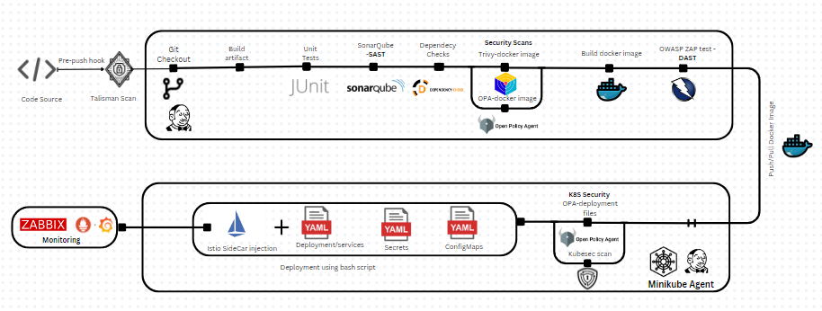

# CRUD Product Application
This project is a CRUD application built with Angular (front-end) and Spring Boot (back-end). I have implemented a secure and fully automated CI/CD pipeline to streamline the development, testing, and deployment processes.

## Project Structure

-   **Angular**: The front-end of the application, developed using Angular, is located in the [`Angular/`](Angular/) folder.
-   **Spring**: The back-end services built with Spring Boot can be found in the [`Spring/`](Spring/) folder.
-   **Deployment Files**: Include deployment files for Kubernetes, Jenkins, and security configurations. 
    -   [`Jenkinsfile`](Jenkinsfile): Defines the CD pipeline.
    -   [`deploy.sh`](springapp-deployment.yml): Deployment configuration for Spring Boot application on Kubernetes.
-   **Scripts and Ansible Playbooks**: Jenkins and Minikube configurations,  Deployment and security testing scripts,  are stored in the [`setup/`](setup/) directory.

## CI/CD Pipeline

### Jenkins Setup

I automated the installation and configuration of Jenkins via an Ansible playbook. The setup ensures that all required plugins.
 *Note:  Java is already installed on my machine, for minikube SSH agent i installed ssh plugin manually*
-   **Ansible Playbooks**: The scripts used to automate Jenkins configuration are stored in the `setup/ansible` directory.
-   **Plugins**: In addition to the default plugins, SSH for Minikube communication was manually installed.

### Testing Tools

Testing tools was configured using Ansible to ensure code quality and security:

-   **Talisman**: This pre-commit hook enforces security checks before commits are allowed. It ensures that no sensitive information, such as secrets or tokens, gets committed to the repository.
-   **SonarQube**: Static code analysis is run through SonarQube to identify code quality issues and vulnerabilities.
-   **OWASP ZAP**: Dynamic Application Security Testing (DAST) is performed using a custom script (`zap_scan.sh`) . 
-   **Test Reports**: Every test (SonarQube, OWASP ZAP, etc.) is published as a report and archived for future reference.

### CI Pipeline (Jenkinsfile)

The Jenkinsfile located at the root of the repository defines the CI pipeline,  automates the building, testing, and security scanning of the application:
-   **Build Artifact**: Builds the Spring Boot application using Maven, and archives the generated `.jar` file.
-   **Unit Tests**: Executes JUnit tests within the Spring Boot project using Maven.
    -   **Test Reports**: JUnit test results are archived for analysis.
-   **Static Analysis**: SonarQube performs **Static Application Security Testing (SAST)** on the codebase.
    -   **SonarQube Configuration**: SonarQube is integrated using environment variables and a Sonar token.
    -   A quality gate is enforced using SonarQube to determine if the code meets security and quality standards.
-   **Vulnerability Scans**:
    -   **Dependency-Check**: A Maven plugin is used to check for vulnerable dependencies, generating a report.
    -   **Trivy Scan**: Trivy scans the Docker image for vulnerabilities via the `trivy-docker-scan.sh` script.
    -   **OPA Scan**: The **Open Policy Agent (OPA)** checks for Docker security policy violations based on rules defined in `opa-docker.rego`.
-   **DAST Tests**: OWASP ZAP runs **Dynamic Application Security Testing (DAST)** to identify vulnerabilities in the running application using the [`zap_scan.sh`](./zap_scan.sh) script.
-   **Build and Push Docker Image**: Builds the Spring Boot Docker image and pushes it to Docker Hub.
-   **Reporting**: Every test (Dependency check, Trivy, OWASP ZAP, etc.) is published as a report and archived for future reference and analysis.

### CD Pipeline (Jenkinsfile in `deployment`)

The CD pipeline is defined in the `Jenkinsfile` located in the [`deployment`](deployment) folder. This pipeline is executed on a Jenkins' Minikube agent and includes:  
        
 **Deployment**:
    
   -   The application is deployed via the `deploy.sh` script. This script automates the deployment of the application to the Minikube environment using the configMap, deployment/service files.
        
 **Security Context**: After testing, additional security measures were added to the Kubernetes deployment file by defining security contexts for the application pods. This ensures proper privileges and access controls are in place, such as limiting privileges, user IDs, and defining resource constraints in the `springapp-deployment.yml`.
    

All test results, including security scans and deployment logs, are archived as part of the pipeline.

## Kubernetes and Istio Integration

### Minikube Deployment

The Kubernetes setup is managed via an Ansible playbook located in the `setup'.  

### Security Enhancements with Istio

I experimented with deploying the application using **Istio** for a service mesh deployment. The Istio sidecar was injected into the application pods, and Istio's monitoring add-ons were used to enhance observability:

-   **Grafana**: For visual monitoring of metrics.
-   **Prometheus**: To collect metrics from the application and services.
-   **Kiali**: For managing and visualizing the service mesh.

These add-ons provided insight into the application’s traffic, performance, and security in the context of a service mesh.

### Security Testing

As part of the deployment process, several security tests were run:    
    -   **OPA Vulnerability Scan**: This stage runs a policy-based security scan using **Open Policy Agent (OPA)** on the Kubernetes deployment file (`springapp-deployment.yml`). The scan used the `openpolicyagent/conftest` container image to test policies defined in the [`OPA-k8s.rego`](OPA-k8s.rego) file, which enforces security rules on the Kubernetes manifests.        
    -   **Kubesec Scan**: This stage performs security analysis using a custom shell script (`kubesec-scan.sh`). The scan uses the **Kubesec** tool to assess the security posture of the Kubernetes manifests.

## Monitoring with Zabbix

For infrastructure and application monitoring, I set up **Zabbix Server** and **Zabbix UI using Ansible** , with agents deployed on minikube node:

-   **Zabbix Agent**: Installed using Helm chart.
-   **Zabbix Proxy**: To handle distributed monitoring of the application.
-   Monitoring dashboards were configured in Zabbix UI using Zabbix as a data source, providing a unified view of the application and infrastructure health.

## Future Improvements

1.  **Kubescan**: In the next iteration, I will incorporate **Kubescan** to compare the security scores of the application when deployed both with and without the Istio sidecar.
2.  **Rollout Strategy**: Implementing a versioned deployment strategy using **Kubernetes Rollouts**, allowing blue-green or canary releases for smoother updates and rollbacks.
